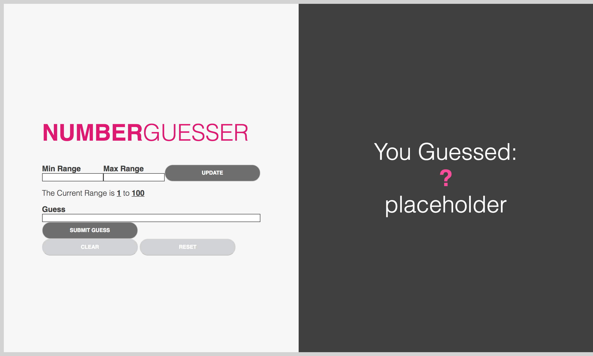
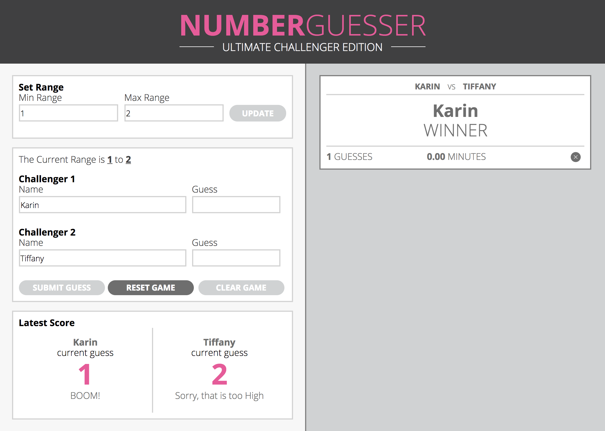
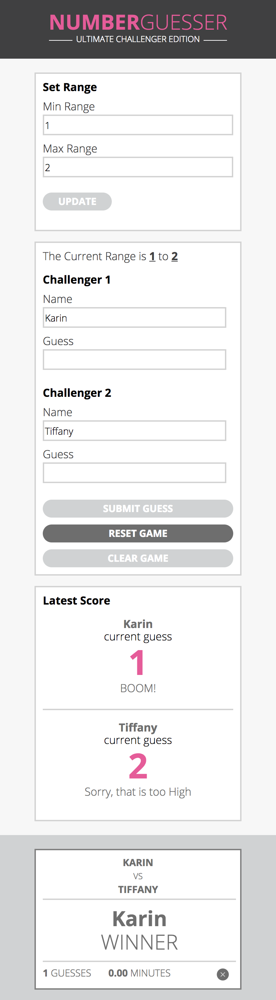

# Number Guesser

## Assignment
Mod 1 - Number Guesser Doubles

## Summary
### Week 1
This goal of the project in Week 1 was to build a game where a user can guess a number between 1 and 100 when they first arrive to the page. The user can then also add a custom number range to change the game contraints, reset the game back to a rangthe user successfully wins, their range is updated to increase the max by 10 and decrease the min by 10. This increases the challenge for the going into the next round of the game.

### Week 2
The goal of the project in Week 2 was to pivot and adjust the game we created from a 1-player game to a 2-player game. Additional functionality for the 2-player games includes:

* Displaying the name of each player
* Tracking how many guesses it takes to get to the correct number
* Tracking how long the game lasts
* Displaying final results of each match on a card
* Ability to delete final results cards
* Animations

## Built With
* HTML
* CSS
* JS

## Contributors
* Karin Ohman
* Tiffany Bachmann

## Final Site Comp

### Week 1 Version

### Week 2 Version

